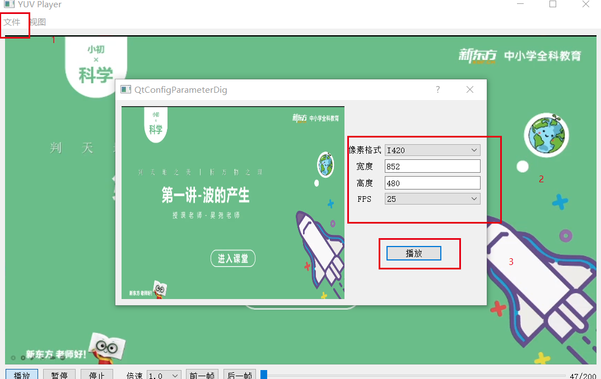
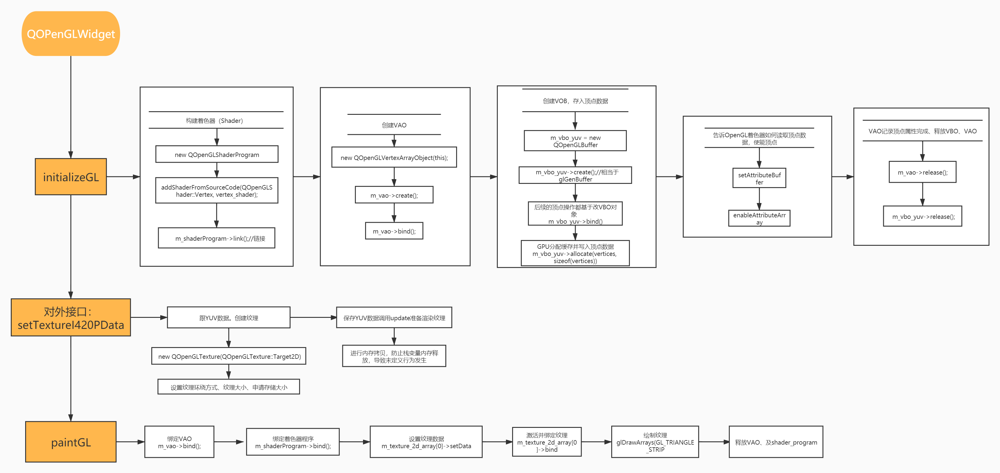

# 项目说明	

* 环境：Qt5.14.2
* 编写一个YUV Player工具，用于播放YUV数据。

注意：目前只支持了YUV420数据，其他的数据格式暂未支持。

# 使用说明

使用Qt对OpenGL的封装类进行实现，提供菜单打开一个YUV420文件。使用单独的一个线程读取YUV文件， 将读取到的数据送入Qt渲染线程（主线程）。

特点：

* 支持Seek
* 支持播放、暂停、停止
* 支持快进、慢放
* 支持单步

* 通过1 选择要播放的YUV文件

* 然后通过2处选择YUV的宽度、高度、播放频率等。

* 点击播放即可进入播放界面

播放界面：

## 实现流程：

